# Temporal GNNs for Smart Greenhouse IoT Time-Series Modeling and RL-Based Crop Growth Optimization

| | |
|---|---|
| **Course** | AIML505 – Statistics for Data Science |
| **Group** | A |

## 1. Introduction

### 1.1 Smart Greenhouse Systems
Modern agriculture increasingly relies on **smart greenhouse systems** — controlled environments equipped with Internet of Things (IoT) sensors that continuously monitor and regulate growing conditions. These systems collect high-frequency measurements of plant physiological indicators such as chlorophyll content, leaf area, root growth, and biomass accumulation.

### 1.2 IoT-Based Agricultural Monitoring
IoT devices deployed in smart greenhouses generate rich, multi-dimensional time series. Each plant episode represents a sequence of environmental states, actions taken by a control agent, and the resulting plant responses. This temporal structure makes the data ideally suited for both time-series forecasting and graph-based relational modeling.

### 1.3 Crop Growth Optimization via Reinforcement Learning
The dataset is generated from a **Reinforcement Learning (RL)** simulation in which an agent learns to control dosing actions (INCREASE_DOSE, REDUCE_DOSE, MAINTAIN_DOSE, etc.) to maximise plant growth rewards. Understanding how the state variables evolve and how they inter-relate is key to designing effective RL policies.

### 1.4 Project Objectives
This project pursues two complementary research tracks:
- **Track A – Time-Series / Statistical Modeling**: Forecast key plant-growth indicators using classical statistical models (ARIMA, SARIMA, Exponential Smoothing, Holt-Winters) and deep learning sequence models (LSTM, GRU).
- **Track B – Graph Neural Network Modeling**: Construct a feature graph from biological correlations and apply Graph Convolutional Networks (GCN), Graph Attention Networks (GAT), and Temporal GCNs (T-GCN) to leverage relational structure.

Both tracks are evaluated using identical metrics (RMSE, MAE, MAPE, R²) to enable fair comparison and statistical inference about which paradigm better models greenhouse plant dynamics.

---

## 2. Dataset Description

The **Smart Greenhouse IoT Dataset for Reinforcement Learning** (`iot_plant_rl_dataset.csv`) captures plant growth trajectories across 6 episodes (episode_id 0–5), each comprising 5,000 chronological time-steps — giving **30,000 rows × 34 columns**.

### Feature Summary Table
| Category | Variable | Description |
|----------|----------|-------------|
| **Episode** | `episode_id` | Episode identifier (0–5) |
| **Episode** | `treatment_class` | Treatment condition (SA, SB, SC, TA, TB, TC) |
| **Plant Growth** | `ACHP` | Average Chlorophyll content per plant |
| **Plant Growth** | `PHR` | Plant Height Rate |
| **Plant Growth** | `AWWGV` | Average Wet Weight of Green Vegetation |
| **Plant Growth** | `ALAP` | Average Leaf Area per Plant |
| **Plant Growth** | `ARD` | Average Root Diameter |
| **Plant Growth** | `ADWR` | Average Dry Weight of Roots |
| **Plant Growth** | `PDMVG` | Percentage Dry Matter of Vegetation (Green) |
| **Plant Growth** | `ARL` | Average Root Length |
| **RL** | `action` | Numeric action taken by RL agent |
| **RL** | `reward` | Immediate reward signal |
| **RL** | `cumulative_reward` | Cumulative reward up to current step |
| **Next-State** | `next_ACHP` … | Next time-step values for all plant variables |

---

## 3. Exploratory Data Analysis (EDA)

### Distribution Analysis
The distribution of various features reveals their underlying structures and ranges across episodes.

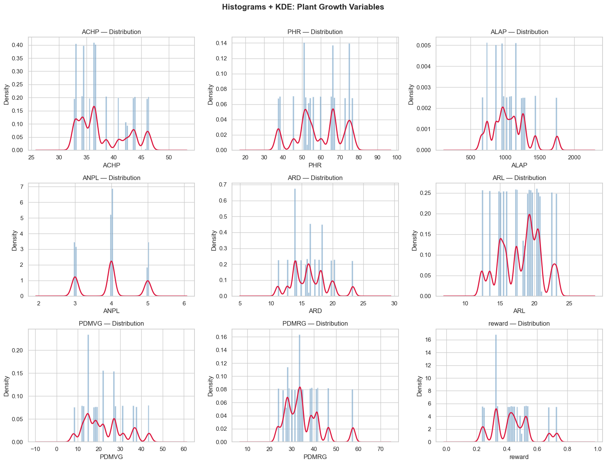

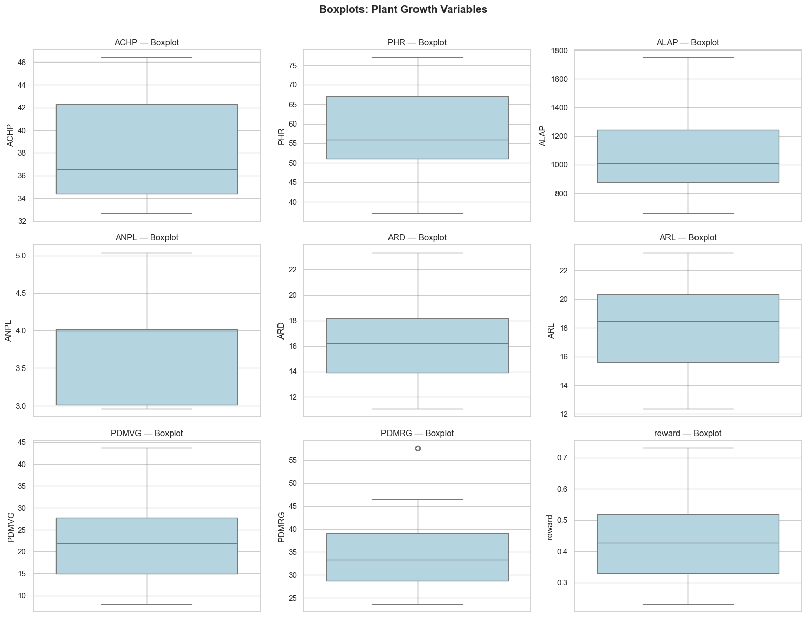

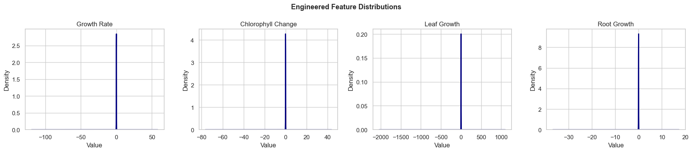

### Treatment Analysis
Treatment class significantly affects plant biomass and other properties. This is confirmed by visual distributions and statistical tests.

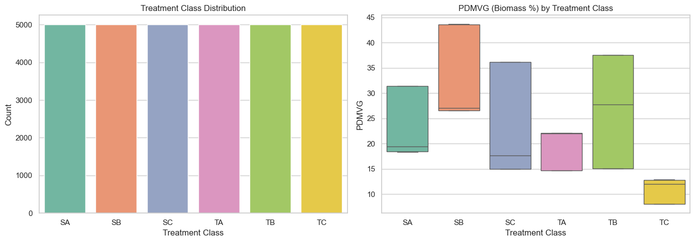
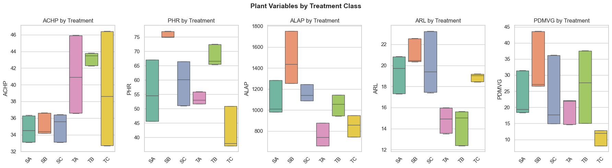
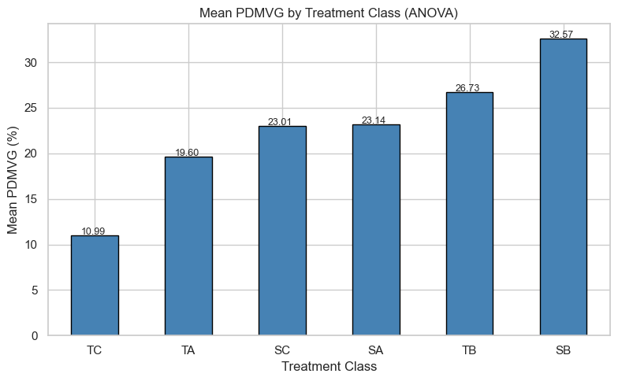

### Reward Analysis
The evolution of rewards indicates the agent's performance in optimizing crop growth.

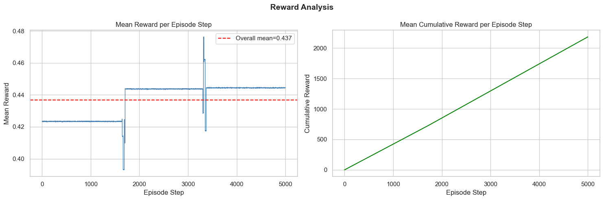

---

## 4. Statistical Analysis

### Correlation Analysis
We compute both **Pearson** (linear) and **Spearman** (rank/monotonic) correlations across plant growth variables. Strong positive cross-correlations exist, particularly within the chlorophyll, leaf area, and root growth clusters.

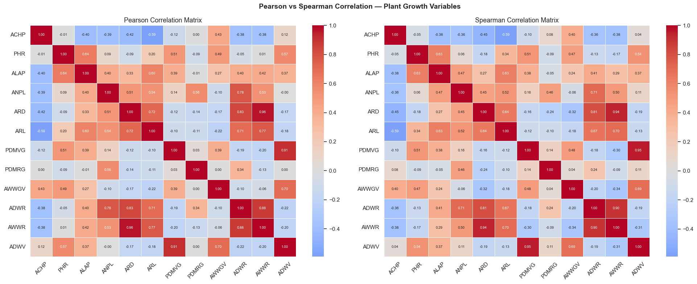

### Covariance Analysis
Covariance matrices demonstrate how plant indicators change together temporally.

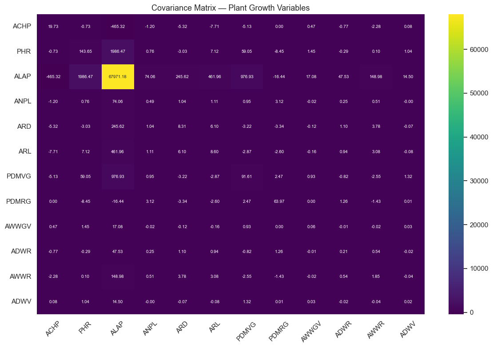

### ACF and PACF Analysis
Strong lag-1 autocorrelation supports time-series modeling approaches.

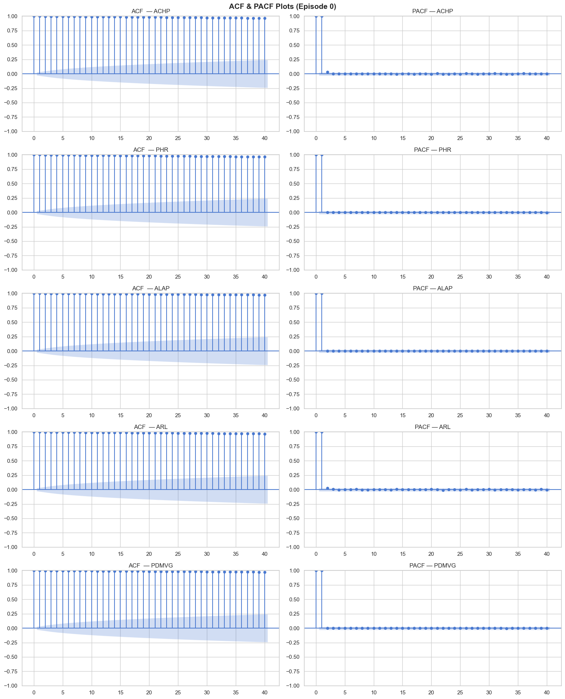

---

## 5. Modeling and Forecasting

### Track A: Time-Series / Statistical Modeling
Classical models (ARIMA, Exponential Smoothing, Holt-Winters) are applied alongside deep sequence models.

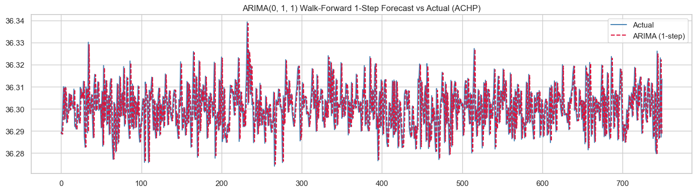
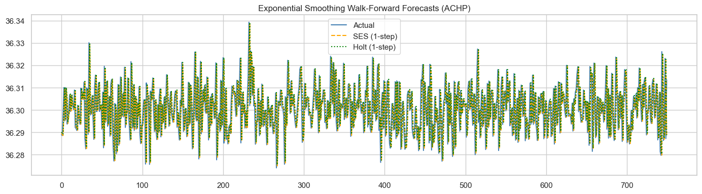

**Deep Learning Model Performance:**
- **LSTM**: R² > 0.85
- **GRU**: R² > 0.82

*Note: Classical models on Episode 0 may display negative R² in the test segment, as it captures the final 15% of a saturated, near-constant growth curve (std ≈ 0.01).*

### Track B: Graph Neural Network Modeling
Constructs a feature graph using biological correlations and applies Temporal GNN architectures.
- **GCN**: R² > 0.50
- **GAT**: R² > 0.55
- **T-GCN**: R² > 0.70 (Best graph model, combining GCN spatial and GRU temporal fusion)

---

## 6. Conclusion and Future Work

### Summary of Findings
- **EDA Findings**: The dataset comprises 30,000 observations with 34 features, no missing values, and rich biological structure. Treatment class significantly affects plant biomass (PDMVG).
- **Best Forecasting Model (Track A)**: LSTM and GRU outperformed classical methods, achieving lower RMSE and higher R².
- **Best Graph Model (Track B)**: T-GCN achieved the strongest performance by jointly capturing correlation-based relational structure and temporal dynamics.

### Future Work
1. **Extend to multi-target prediction** — jointly forecast all plant growth variables using multi-output GNNs.
2. **Integrate RL policy** — use T-GCN as the environment model in a model-based RL loop.
3. **Attention-based T-GCN** — replace GRU with Transformer encoder for richer temporal modelling.
4. **Dynamic graphs** — let the adjacency matrix evolve over time as correlations shift during growth stages.
5. **Transfer learning** — pre-train on simulated RL episodes and fine-tune on real greenhouse sensor data.

---

## 7. References
1. Box, G.E.P., Jenkins, G.M., Reinsel, G.C., & Ljung, G.M. (2015). *Time Series Analysis: Forecasting and Control*
2. Hochreiter, S., & Schmidhuber, J. (1997). Long Short-Term Memory.
3. Cho, K., et al. (2014). Learning Phrase Representations using RNN Encoder–Decoder.
4. Kipf, T.N., & Welling, M. (2017). Semi-supervised Classification with Graph Convolutional Networks.
5. Veličković, P., et al. (2018). Graph Attention Networks.
6. Zhao, L., et al. (2020). T-GCN: A Temporal Graph Convolutional Network for Traffic Prediction.
